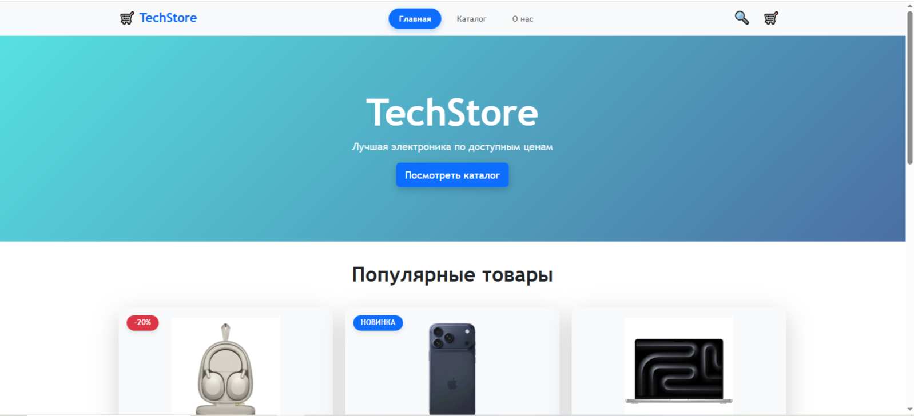
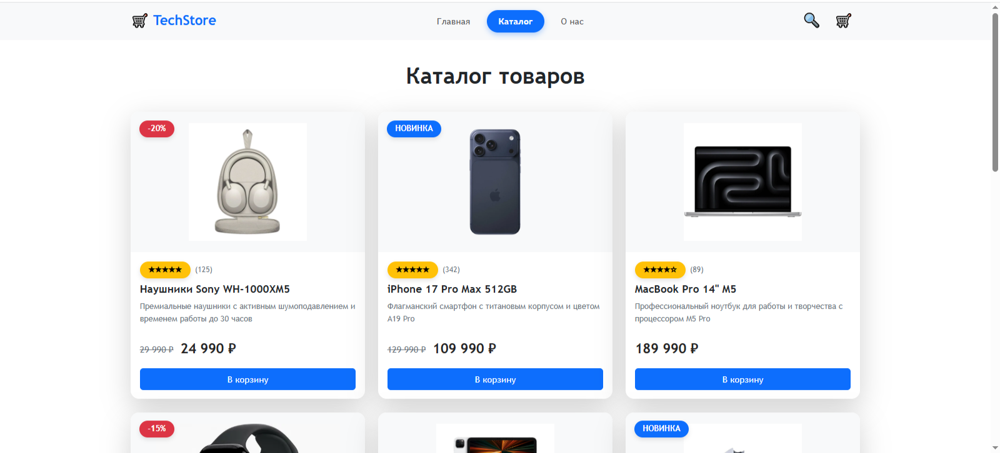
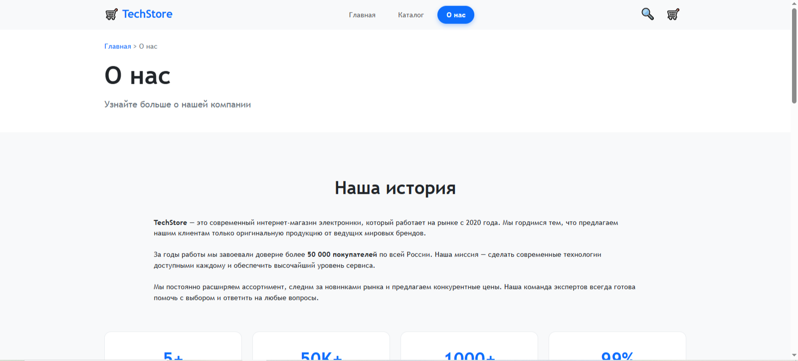

# **Лабораторная работа №14-16 - Интернет-магазин "TechStore"**
##### **ФИО:** Старцева Полина Сергеевна
#### **Группа:** ИСП-231
#### **Дата:** 06.03.2026
---
## Описание проекта
Многостраничный сайт интернет-магазина электроники "TechStore" с адаптивной вёрсткой.
## Реализованные страницы
- **Главная** — приветственный баннер, популярные товары, преимущества
- **Каталог** — сетка из 9 карточек товаров с фильтрами
- **О нас** — информация о магазине и команде
## Реализованные функции
Адаптивное навигационное меню
- Карточки товаров с hover-эффектами
- Bootstrap 5
- Адаптивная вёрстка (desktop/tablet/mobile)
- Единая цветовая схема и типографика
- Семантическая HTML5-разметка
## Технологии
- Bootstrap 5
- HTML5
- CSS3 
- Git/GitHub
## Скриншоты
- Главная страница

- Каталог товаров

- О нас
